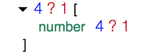

## REInfer: Runtime Extended Inference

REInfer performs **R**untime **E**xtended type **Infer**ence on json data. Compared to traditional types, the extended types incorporate some numerical information, such as the number of times a field appears in the data, or the number of times it is null.

A facility is provided to compare inferred types. This follows the idea of a diff algorithm which takes two values and returns the difference. The difference consists of a common part plus two deltas. Deltas are applied using a sum operation for extended types. The diff algorithm borrows and extends ideas from abduction for shape analysis, applied to type theory instead of program logic.

A simple UI is provided to experiment with the primitives: it can be used to visualize inferred types and their difference.

There is a thought experiment exploring of the use of runtime type inference in conjunction with runtime type checking. This combination gives an instrumented semantics that can be used to execute programs. This instrumented semantics has the peculiar property that it can fail at run time in cases where the program is not statically typable. In contrast to ordinary testing, this also applies to programs that **do not fail** when executed under a normal semantics.


## Run Project

```sh
npm install
npm start
# in another tab
npm run serve
```

Then open the served page in the browser and edit `Demo.re`.


### Example of type inference

```
val1:
{"x":"hello"}

val2:
{"x":null, "y":0}
```

Type inference will produce types `styp1` and `styp2`


The numerical information indicates that fied `x` occurs once. But in the second value it has optional type `? 1`, indicating that 1 (out of 1) value of x is null.

Numbers begin to add up when using arrays, or when sampling multiple values.
For example, `[null,2,3,4]` has this type:




### Example of diff

Once the types for `val1` and `val2` have been computed, a difference algorithm computes a type `stypB`:


The type highlights what sub-parts which are in common. Also, `lhs` highlights the subpart that the first type has in addition to the common part, and correspondingly for `rhs`.

It is also possible to look at `stypA1` and `stypA2` that indicate the overall difference between the common type and the two resulting ones:


## References

* Tree view UI adapted from [react-treeview](https://github.com/chenglou/react-treeview).

* Abduction in shape analysis <https://dl.acm.org/citation.cfm?id=2049700>.

## License

This project is [MIT-licensed](./LICENSE.md).


## Formalisation


### Values

```
val ::=
  123 |
  “abc” |
  true | false |
  null |
  obj |
  [ val1, …, valn ]

obj ::= { x1:val, …, xn:val }
```


### Types

Types: `t` are ordinary types of a programming language, with `t?` an optional type.

```
t ::=
  empty |
  number |
  string |
  boolean |
  t? |
  {x1:t, …, xn:t} |
  [ t ]
```


### Statistical Types

Statistical types are a mutual definition of `styp` and `typ`.

```
o ::= opt(p) | notOpt
```

```
styp ::= (typ,o)::p
```

```
typ ::=
  empty |
  number |
  string |
  boolean |
  {x1:styp1, …, xn:stypn} |
  [styp]
```

Abbreviation: write `typ?n::p` or `typ::p`.

### Type checking for Types

[Type checking for t](doc/TypeCheckingTypes.md): `|- val : t`


### Erasure of Statistical Types

[Erasure](doc/Erasure.md): `|- |styp| = t`


### Type checking for Statistical Types

[Type checking for styp](doc/TypeCheckingStyp.md):  `|- val : styp`


### Sum of Statistical Types

[Sum operations](doc/SumOperations.md): `|- styp1 + styp2 = styp` and `|- typ1 + typ2 = typ` and `|- o1 + o2 = o`.

Notice this defines a partial commutative monoid.


### Inference of Statistical Types from value samples

Given a set of sampled data `val1, …, valn` define a process of type inference `|- val1, …, valn -> styp`. The process consists of using the existing inference for arrays:

```
|- [val1, …, valn] : [styp]
———————————————————————————
 |- val1, …, valn -> styp
```


### Abduction for Statistical Types

[Abduction](doc/Abduction.md): `|- styp1 + <stypA> = styp2` and `|- typ1 + <typA> = typ2` and `|- o1 + <oA> = o2`.

Want smallest solution w.r.t. `<=` where `styp1 <= styp2` if there is `styp` such that `|- styp1 + styp = styp2`.

Abduction computes the smallest representation of the difference between statistical types.

(Note negation corresponding to + does not exist)


### Diff for Statistical Types

[Diff](doc/Diff.md): `|- <stypA1,stypA2> + <stypB> = styp1,styp2`
and `|- <typA1,typA2> + <typB> = typ1,typ2` and `|- <oA1,oA2> + <oB> = o1,o2`.

Want largest solution w.r.t. `<=` for the `B` part, and smallest for the `A1` and `A2` parts, where `styp1 <= styp2` if there is `styp` such that `|- styp1 + styp = styp2`.


### Extension: Union Types

```
stypU ::= styp1 | ... | stypn

typ += union(stypU)
```

Write `typ1 # typ2` when there is no `typ` such that `|- typ1 + typ2 = typ`, with the corresponding extension `styp1 # styp2`.

The sum of `stypU` written `|- stypU1 + stypU2 = stypU` is defined below.
The conversion `|- u(styp) = stypU` is also defined below.

[Union Extension](doc/UnionExtension.md) of `|- styp1 + styp2 = styp` and `|- <stypA1,stypA2> + <stypB> = styp1,styp2`.


### Extension: Singleton Types

TODO